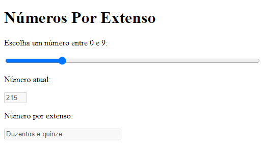

# FullNumber
Trabalho Prático do Módulo I do Bootcamp Fullstack Developer do [IGTI](https://igti.com.br).

## Instruções
Para iniciar a aplicação, abra o `index.html` no seu navegador da web.

Por meio de um controle deslizante, selecione um número para ver a forma numérica e por extenso.

## Tecnologias utilizadas
- HTML
- CSS
- JavaScript

## Screenshots

